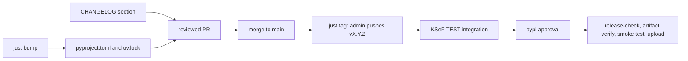

## Version source

`project.version` in `pyproject.toml` is the only version this repository
declares. `uv version --bump` rewrites it and re-locks `uv.lock`.
`ksef2.__version__` reads installed distribution metadata, so an installed SDK
reports the version it was installed as and cannot drift from the declaration.

## Check repository setup

Confirm these settings with a repository administrator:

- Protect `main` with required PR review and CI checks. Merging a release is not
  authorization to publish; pushing the tag is.
- Keep both tag rulesets. `Release tag creation` allows only repository
  administrators to create `refs/tags/v*`, and `Immutable release tags` rejects
  updating or deleting them. The publish steps below therefore need
  administrator rights.
- Keep the `pypi` environment's required reviewers and deployment rules. That
  approval applies to the upload job after integration tests pass.
- Configure the PyPI trusted publisher for `stacking-hq/ksef2`, workflow
  `publish.yml`, and environment `pypi`. The upload uses OIDC, so no `PYPI_TOKEN`
  or personal access token is involved.
- Retain the integration credentials `KSEF_TEST_SUBJECT_NIP`,
  `KSEF_TEST_PERSON_NIP`, and `KSEF_TEST_PERSON_PESEL`. Keep
  `DOCS_DISPATCH_TOKEN` configured if releases should deploy documentation.

## Bump and document

```bash
just bump patch        # or minor, or major
just changelog-seed    # commits since the previous tag, one bullet per line
```

1. Edit `CHANGELOG.md`. Start the new section with `## vX.Y.Z (YYYY-MM-DD)` at the
   top of the file and rewrite the seeded bullets for people who upgrade.
   `scripts/verify_release.py` fails the publish run when that heading is absent.
2. Run `just release-check`.
3. Open a PR targeting `main`. A release changes `pyproject.toml`, `uv.lock`, and
   `CHANGELOG.md`. Review it like any other change, then merge.

Merging publishes nothing.

## Publish

```bash
just tag 0.21.1
```

`just tag` refuses when the requested version does not match `project.version`,
then creates and pushes the annotated tag. Tags are immutable, so check the
version and the commit before pushing.

Pushing `vX.Y.Z` starts **Publish to PyPI**:



Approve the `pypi` deployment when prompted, then confirm the upload before
announcing anything:

```bash
gh run list --workflow=publish.yml --limit 3
gh run watch RUN_ID
```

Create the GitHub Release only after the upload succeeded, so notes never
announce a version that is not installable:

```bash
just release 0.21.1
```

`just release` extracts the `## vX.Y.Z` section of `CHANGELOG.md`, fails when the
section is missing, and passes it to `gh release create` as the release body. The
changelog section is the source of truth because it is the only release text that
passes review; the GitHub body is derived from it instead of written a second
time.

## Recover a failed release

Never delete, move, or overwrite a release tag. The rulesets reject it, and PyPI
rejects a second upload of the same version.

- Before the tag push, fix `pyproject.toml`, `uv.lock`, or `CHANGELOG.md` in a new
  reviewed PR. A failure before tagging has no side effects.
- If the tag exists and a job failed, rerun the failed jobs of that
  **Publish to PyPI** run. The `pypi` approval and the release checks still apply.
- If the tag exists but no run started, dispatch the workflow at the tag. This is
  the only reason manual dispatch exists, and it runs the same checks against the
  same immutable tag:

  ```bash
  gh workflow run publish.yml --repo stacking-hq/ksef2 --ref v0.21.1
  ```

- If the upload may have succeeded, inspect PyPI and the run logs before any
  retry. Code changes after a successful upload need a new release with a higher
  version.
- If only the documentation dispatch failed, rerun that job. Do not repeat the
  upload.

Concurrent publish runs for the same ref are serialized, but a duplicate run can
still attempt an upload. Check existing runs before retrying.

## Check the release tooling without publishing

```bash
uv run pytest tests/unit/test_verify_release.py -q
```

The test builds a temporary tree with a fake `pyproject.toml`, changelog, wheel,
and sdist, then confirms `scripts/verify_release.py` accepts a matching tag and
reports both a tag that disagrees with `project.version` and a wheel whose
`METADATA` disagrees.
