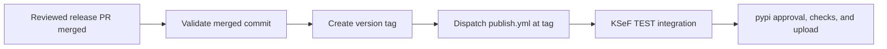

## Check repository setup

Before the first automated release, merge the release automation into `main`.
Confirm these settings with a repository administrator:

- Protect `main` with required PR review and CI checks. The automation treats
  merging a release PR as authorization to release.
- Allow the release workflow's `GITHUB_TOKEN` to create tags and dispatch Actions
  workflows. If a tag ruleset restricts creation, authorize this workflow.
- Keep the `pypi` environment's required reviewers and deployment rules. Its
  approval applies to the publish job after integration tests pass.
- Configure the PyPI trusted publisher for `stacking-hq/ksef2`, workflow
  `publish.yml`, and environment `pypi`.
- Retain the integration credentials `KSEF_TEST_SUBJECT_NIP`,
  `KSEF_TEST_PERSON_NIP`, and `KSEF_TEST_PERSON_PESEL`. Keep
  `DOCS_DISPATCH_TOKEN` configured if releases should deploy documentation.

No additional personal access token or GitHub App is required for publication.

## Prepare and merge the release PR

1. Create a branch named `release/X.Y.Z` in `stacking-hq/ksef2` from current
   `main`. For example, use `release/0.21.0`. Choose a stable SDK version greater
   than the PR base version. Do not use the KSeF API version or a prerelease suffix.
2. Set the same version in `project.version` and `tool.commitizen.version` in
   `pyproject.toml`, and in `src/ksef2/__version__.py`.
3. Start `CHANGELOG.md` with `## vX.Y.Z (YYYY-MM-DD)` and describe the release.
4. Run `uv lock` to update the package version in the lockfile.
5. Run `just release-check` and review the release changes in a PR targeting
   `main`. Resolve CI failures before merging.
6. Merge the reviewed PR. Watch **Release merged PR**, then **Publish to PyPI**.
7. After integration passes, approve the `pypi` deployment when prompted. Check
   that the release checks, artifact verification, wheel smoke test, and upload
   succeed before announcing the release.



The tag targets the PR's exact merged commit, even if `main` advances before the
workflow starts. The action rejects inconsistent versions, a missing leading
changelog heading, a commit outside `main`, and any existing version tag.
Ordinary PR merges and release branches from forks do not start publishing.

The action explicitly dispatches `publish.yml` at the new tag. A tag created
with `GITHUB_TOKEN` does not trigger the existing tag-push workflow, but
[`workflow_dispatch` is exempt from event suppression](https://docs.github.com/en/actions/how-tos/write-workflows/choose-when-workflows-run/trigger-a-workflow).
Both entry points run the same checks against a pinned commit.

## Recover a failed release

Never delete, move, or overwrite a release tag to retry a release.

- If validation failed before tagging, inspect the failed run. Fix release
  metadata in a new reviewed release PR. Rerunning the old event still validates
  its original merged commit.
- If a transient failure occurred before tag creation, rerun **Release merged
  PR** after confirming that the tag is absent.
- If the tag exists but dispatch failed, confirm that it targets the merged PR
  commit, then dispatch **Publish to PyPI** at that tag. Use the full merged SHA:

  ```bash
  gh workflow run publish.yml --repo stacking-hq/ksef2 --ref v0.21.0 --field release_sha=FULL_MERGED_SHA
  ```

- If integration or publishing failed, rerun failed jobs in the existing
  **Publish to PyPI** run. The `pypi` approval and release checks still apply.
- If upload may have succeeded, inspect PyPI and the run logs before retrying.
  PyPI does not allow replacing an uploaded version. For code changes, prepare
  a new release PR with a higher version.
- If only documentation deployment failed, rerun that failed job. Do not repeat
  the package upload.

Rerunning the tag-creation job with an existing tag fails, even when its SHA
matches. Dispatch at a branch or with a mismatched SHA fails before integration.
Concurrent publish runs for the same ref are serialized, but duplicate runs can
still attempt an upload. Check existing runs before dispatching a retry.

## Verify automation without releasing

Run the offline regression tests:

```bash
uv run pytest tests/unit/test_release_pr.py tests/unit/test_verify_release.py -q
```

These tests use temporary Git repositories and a fake `gh` executable. They
exercise tag creation and dispatch failures without creating repository tags or
contacting PyPI.

To validate a saved `pull_request.closed` event locally, fetch `origin/main` and
check out the event's `merge_commit_sha`. Run:

```bash
python -m scripts.release_pr --event /path/to/event.json
```

The command reads remote tags but does not create a tag or dispatch a workflow.
Only `--execute` enables those operations. Do not use that flag for a dry run.
