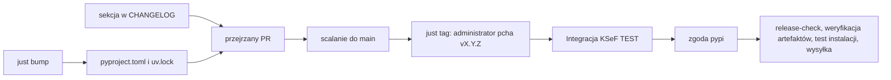

## Źródło wersji

`project.version` w `pyproject.toml` to jedyna wersja deklarowana w repozytorium.
`uv version --bump` aktualizuje ją i przeblokowuje `uv.lock`.
`ksef2.__version__` odczytuje metadane zainstalowanej dystrybucji, więc
zainstalowany SDK zgłasza wersję, z której go zainstalowano, i nie może rozjechać
się z deklaracją.

## Sprawdź konfigurację repozytorium

Potwierdź z administratorem repozytorium następujące ustawienia:

- Chroń `main` wymaganym przeglądem PR i kontrolami CI. Scalenie wydania nie jest
  zgodą na publikację; zgodą jest push taga.
- Zachowaj obie reguły tagów. `Release tag creation` zezwala na tworzenie
  `refs/tags/v*` wyłącznie administratorom, a `Immutable release tags` blokuje ich
  zmianę i usuwanie. Kroki publikacji poniżej wymagają więc uprawnień
  administratora.
- Zachowaj wymagane zatwierdzenia i reguły wdrożeń środowiska `pypi`. Zatwierdzenie
  dotyczy zadania wysłania pakietu po testach integracyjnych.
- Skonfiguruj trusted publisher w PyPI dla `stacking-hq/ksef2`, workflow
  `publish.yml` i środowiska `pypi`. Publikacja używa OIDC, więc nie ma tu
  `PYPI_TOKEN` ani tokena osobistego.
- Zachowaj sekrety integracyjne `KSEF_TEST_SUBJECT_NIP`, `KSEF_TEST_PERSON_NIP`
  i `KSEF_TEST_PERSON_PESEL`. Ustaw `DOCS_DISPATCH_TOKEN`, jeśli wydania mają
  wdrażać dokumentację.

## Zmień wersję i opisz zmiany

```bash
just bump patch        # albo minor, albo major
just changelog-seed    # commity od poprzedniego tagu, po jednym punkcie w linii
```

1. Popraw `CHANGELOG.md`. Nową sekcję zacznij od `## vX.Y.Z (YYYY-MM-DD)` na
   początku pliku i przepisz wygenerowane punkty tak, żeby czytało się je przy
   aktualizacji. `scripts/verify_release.py` odrzuci publikację bez tego nagłówka.
2. Uruchom `just release-check`.
3. Utwórz PR do `main`. Wydanie zmienia `pyproject.toml`, `uv.lock` i
   `CHANGELOG.md`. Przejrzyj PR jak każdy inny i scal.

Scalenie niczego nie publikuje.

## Opublikuj

```bash
just tag 0.21.1
```

`just tag` odmawia, gdy podana wersja jest inna niż `project.version`, a potem
tworzy i wypycha tag anotowany. Tagi są niezmienne, więc sprawdź wersję i commit
przed pushem.

Push `vX.Y.Z` uruchamia **Publish to PyPI**:



Zatwierdź wdrożenie `pypi`, gdy pojawi się prośba, i sprawdź wysyłkę przed jakąkolwiek
zapowiedzią:

```bash
gh run list --workflow=publish.yml --limit 3
gh run watch RUN_ID
```

Release na GitHubie utwórz dopiero po udanej wysyłce, żeby notki nie zapowiadały
wersji, której nie da się zainstalować:

```bash
just release 0.21.1
```

`just release` wyciąga sekcję `## vX.Y.Z` z `CHANGELOG.md`, przerywa, gdy jej nie ma,
i przekazuje ją do `gh release create` jako treść wydania. Sekcja changelogu jest
źródłem prawdy, bo jako jedyna przechodzi przegląd, a treść na GitHubie jest z niej
wyciągana, a nie pisana drugi raz.

## Ponów nieudane wydanie

Nigdy nie usuwaj, nie przesuwaj ani nie nadpisuj tagu wydania. Blokują to reguły, a
PyPI odrzuca ponowne wysłanie tej samej wersji.

- Przed pushem tagu popraw `pyproject.toml`, `uv.lock` albo `CHANGELOG.md` w nowym
  przejrzanym PR. Błąd przed otagowaniem nie ma skutków ubocznych.
- Jeśli tag istnieje, a zadanie się nie powiodło, ponów nieudane zadania tego
  uruchomienia **Publish to PyPI**. Zgoda `pypi` i kontrole wydania nadal obowiązują.
- Jeśli tag istnieje, ale żadne uruchomienie się nie zaczęło, uruchom workflow na
  tym tagu. To jedyny powód istnienia ręcznego dispatch, a kontrole są te same dla
  tego samego niezmiennego tagu:

  ```bash
  gh workflow run publish.yml --repo stacking-hq/ksef2 --ref v0.21.1
  ```

- Jeśli pakiet mógł już trafić do PyPI, sprawdź PyPI i logi przed ponowieniem.
  Zmiany kodu po udanej wysyłce wymagają nowego wydania z wyższą wersją.
- Jeśli nie powiodło się tylko wdrożenie dokumentacji, ponów to zadanie. Nie
  powtarzaj wysyłania pakietu.

Publikacje tego samego ref wykonują się kolejno, ale powtórne uruchomienie nadal może
podjąć próbę wysłania pakietu. Sprawdź istniejące uruchomienia przed ponowieniem.

## Sprawdź narzędzia bez publikacji

```bash
uv run pytest tests/unit/test_verify_release.py -q
```

Test buduje tymczasowe drzewo z fikcyjnym `pyproject.toml`, changelogiem, wheel i
sdist, a potem sprawdza, że `scripts/verify_release.py` akceptuje zgodny tag oraz
zgłasza zarówno tag inny niż `project.version`, jak i wheel z niezgodnym
`METADATA`.
