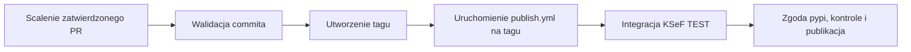

## Sprawdź konfigurację repozytorium

Przed pierwszym automatycznym wydaniem scal automatyzację z `main`.
Potwierdź z administratorem repozytorium następujące ustawienia:

- Chroń `main` wymaganym przeglądem PR i kontrolami CI. Automatyzacja traktuje
  scalenie PR wydania jako zgodę na wydanie.
- Zezwól tokenowi `GITHUB_TOKEN` na tworzenie tagów i uruchamianie workflow.
  Jeśli reguły tagów ograniczają ich tworzenie, uprawnij ten workflow.
- Zachowaj wymagane zatwierdzenia i reguły wdrożeń środowiska `pypi`.
  Zatwierdzenie dotyczy zadania publikacji po testach integracyjnych.
- Skonfiguruj trusted publisher w PyPI dla `stacking-hq/ksef2`, workflow
  `publish.yml` i środowiska `pypi`.
- Zachowaj sekrety integracyjne `KSEF_TEST_SUBJECT_NIP`, `KSEF_TEST_PERSON_NIP`
  i `KSEF_TEST_PERSON_PESEL`. Ustaw `DOCS_DISPATCH_TOKEN`, jeśli wydania mają
  wdrażać dokumentację.

Publikacja nie wymaga dodatkowego tokena osobistego ani aplikacji GitHub.

## Przygotuj i scal PR wydania

1. Utwórz gałąź `release/X.Y.Z` w `stacking-hq/ksef2` z aktualnego `main`,
   na przykład `release/0.21.0`. Wybierz stabilną wersję SDK wyższą od wersji
   bazowej PR. Nie używaj wersji API KSeF ani sufiksu wersji wstępnej.
2. Ustaw tę samą wersję w `project.version` i `tool.commitizen.version` w
   `pyproject.toml`.
3. Rozpocznij `CHANGELOG.md` nagłówkiem `## vX.Y.Z (YYYY-MM-DD)` i opisz zmiany.
4. Uruchom `uv lock`, aby zaktualizować wersję pakietu w pliku blokady.
5. Uruchom `just release-check` i przeprowadź przegląd PR do `main`.
   Rozwiąż błędy CI przed scaleniem.
6. Scal zatwierdzony PR. Obserwuj **Release merged PR**, a następnie
   **Publish to PyPI**.
7. Po testach integracyjnych zatwierdź wdrożenie `pypi`, gdy pojawi się prośba.
   Przed ogłoszeniem wydania sprawdź wynik kontroli, weryfikacji artefaktów,
   testu instalacji wheel i publikacji.



Tag wskazuje dokładny commit scalenia PR, nawet jeśli `main` otrzyma późniejsze
zmiany. Akcja odrzuca niespójne wersje, brak nagłówka wydania na początku
changeloga, commit spoza `main` i każdy istniejący tag danej wersji.
Zwykłe PR oraz gałęzie wydań z forków nie uruchamiają publikacji.

Akcja uruchamia `publish.yml` na nowym tagu przez `workflow_dispatch`.
Tag utworzony za pomocą `GITHUB_TOKEN` nie uruchamia workflow zdarzenia push,
ale [`workflow_dispatch` jest wyjątkiem od tej reguły](https://docs.github.com/en/actions/how-tos/write-workflows/choose-when-workflows-run/trigger-a-workflow).
Oba sposoby uruchomienia wykonują te same kontrole na ustalonym commicie.

## Ponów nieudane wydanie

Nigdy nie usuwaj, nie przesuwaj ani nie nadpisuj tagu wydania w celu ponowienia.

- Jeśli walidacja nie powiodła się przed utworzeniem tagu, sprawdź logi.
  Popraw metadane w nowym PR wydania. Ponowienie starego zdarzenia nadal sprawdza
  oryginalny commit scalenia.
- Jeśli przejściowy błąd wystąpił przed utworzeniem tagu, potwierdź brak tagu
  i ponów **Release merged PR**.
- Jeśli tag istnieje, ale uruchomienie publikacji nie powiodło się, potwierdź,
  że tag wskazuje commit scalenia PR. Uruchom publikację z pełnym SHA:

  ```bash
  gh workflow run publish.yml --repo stacking-hq/ksef2 --ref v0.21.0 --field release_sha=FULL_MERGED_SHA
  ```

- Jeśli testy integracyjne lub publikacja nie powiodły się, ponów nieudane
  zadania istniejącego uruchomienia **Publish to PyPI**. Zgoda `pypi` i kontrole
  wydania nadal obowiązują.
- Jeśli pakiet mógł już trafić do PyPI, sprawdź PyPI i logi przed ponowieniem.
  PyPI nie pozwala zastąpić opublikowanej wersji. Zmiany kodu wymagają nowego
  PR wydania z wyższą wersją.
- Jeśli nie powiodło się tylko wdrożenie dokumentacji, ponów to zadanie.
  Nie powtarzaj wysyłania pakietu.

Ponowienie tworzenia istniejącego tagu kończy się błędem, nawet gdy SHA jest
zgodne. Uruchomienie publikacji na gałęzi lub z innym SHA kończy się przed
integracją. Publikacje tego samego ref wykonują się kolejno, ale powtórne
uruchomienie nadal może podjąć próbę wysłania pakietu. Sprawdź istniejące
uruchomienia przed ponowieniem.

## Sprawdź automatyzację bez publikacji

Uruchom testy offline:

```bash
uv run pytest tests/unit/test_release_pr.py tests/unit/test_verify_release.py -q
```

Testy używają tymczasowych repozytoriów Git i zastępczego programu `gh`.
Sprawdzają tworzenie tagów i błędy uruchamiania workflow bez tworzenia tagów
w repozytorium projektu i bez kontaktu z PyPI.

Aby lokalnie sprawdzić zapisane zdarzenie `pull_request.closed`, pobierz
`origin/main` i przejdź na commit `merge_commit_sha` ze zdarzenia. Uruchom:

```bash
python -m scripts.release_pr --event /path/to/event.json
```

Polecenie odczytuje zdalne tagi, ale nie tworzy tagu ani nie uruchamia workflow.
Dopiero `--execute` włącza te operacje. Nie używaj tej flagi do próbnego przebiegu.
